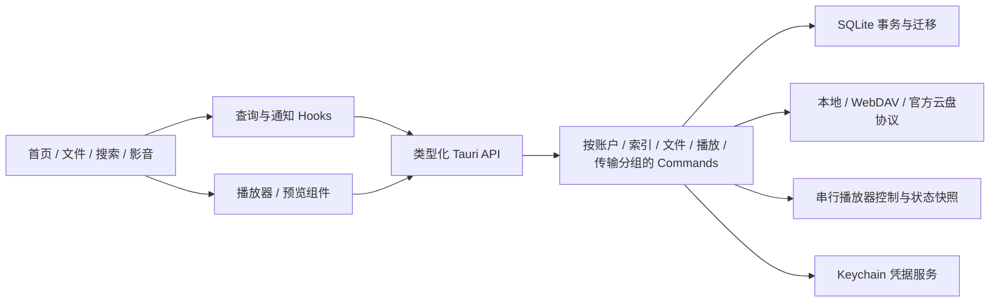

# Cove 个人 Space：产品、架构与业务验收

日期：2026-09-12。定位：个人文件与影音的统一入口。本轮是代码改造与本地验收，不是“全部云服务、所有媒体格式已经通过”的承诺。

## 产品结构与本轮实现

首页提供文件、影视、音乐三个并列入口，支持直接打开存储位置和继续播放。新增文件入口聚合本地与云盘账号；不要求先创建媒体库才能访问文件。统一搜索覆盖已入库的影音和存储位置，并明确其他文件需进入目录查找。

界面采用偏深色的液态玻璃风格：半透明导航、柔和背景渐变、玻璃边缘高光、圆角容器和浮动播放控制层。正文保持对比度；兼容减少动态效果、减少透明度和高对比度系统偏好。`src/space.css` 集中管理主题，避免把视觉代码嵌入业务组件。此实现是 Web 界面的风格实现，不是接入苹果原生 Liquid Glass 材质 API。

## 本轮新发现与修复

| ID | 问题与用户影响 | 修改 |
|---|---|---|
| S01 | 添加媒体目录的两个回调都会启动扫描，重复消耗网络并竞争索引 | 只由一个扫描回调启动任务 |
| S02 | 播放状态每 500ms 重读文件、更新根组件并生成空通知 | 仅 fileId 改变时读取，拒绝过期响应；过滤空通知并限制数量 |
| S03 | 全库搜索实际只打开影视，歌曲无法从首页找到 | 新增跨影音与位置的搜索页，明确搜索范围 |
| S04 | 首页只有影音，文件管理缺少一级入口 | 新增文件页、三个并列入口和存储快捷访问 |
| S05 | 云盘文档路径被送给本地文本读取器 | Provider 能力判断，只为本地文件调用文本读取 |
| S06 | 连续点开文档时，旧请求覆盖新预览 | 预览请求序号；关闭/卸载作废旧请求 |
| S07 | 预览读取失败没有原因，Escape 无效且焦点丢失 | 显示读取错误；dialog 语义；Escape 关闭与焦点返回 |
| S08 | 两个百度账号间或只读来源的复制按钮可触发不支持的操作 | 复制能力矩阵用于前端禁用和执行前校验 |
| S09 | 新建目录缺少统一名称校验，虚拟本机根目录允许创建 | 前后端拒绝空名称、斜杠、NUL、点路径；虚拟根目录禁用新建/粘贴 |
| S10 | 本地文件读取阻塞异步执行，读取期间增大的文件无上限 | 后台阻塞任务、普通文件检查、5MB 有界读取 |
| S11 | 调用系统打开后不检查结果，路径也可能是 URL/参数 | 校验现有绝对路径，检查 open 退出状态 |
| S12 | 新目录播放可能沿用旧队列；音乐目录只提交视频兄弟文件 | 清理空队列，按当前文件类型构建队列 |
| S13 | 从长列表返回首页保留底部滚动位置，错过首页内容 | 切换页面和存储账号重置内容滚动 |
| S14 | 浏览器预览的复制、扫描、连接返回假成功 | 非桌面环境明确报错，演示数据有标识 |
| S15 | AI 字幕密钥明文保存在 WebView localStorage | 新增 Keychain 保存/读取；旧值迁移成功后移除明文值 |
| S16 | 字幕生成完成后视频已切换，字幕错加载；底层错误被忽略 | 将字幕加载绑定文件并串行确认，区分已保存与已加载 |
| S17 | 无时间轴的转写结果伪造5秒字幕，翻译失败仍显示成功 | 缺少时间戳或翻译不完整时报错，不覆盖已有字幕 |
| S18 | 提取音频失败留下临时文件；字幕文件ID缺少路径校验 | 临时文件守卫与安全文件ID校验 |
| S19 | 自定义转写服务的翻译仍走默认地址 | 翻译端点保持在配置的同一服务 |

之前的视频红黄绿按钮覆盖、歌词缓存缺失、索引一致性等问题见 `QUALITY-REVIEW-2026-09-12.md` 与根目录 `AUDIT-2026-09-11.md`。原生窗口桥接已修正标题栏避让；红黄绿按钮仍需以最终完整应用多窗口验收为准。

## 业务流程测试矩阵

“自动通过”表示执行的单元/服务回归通过；“界面通过”使用浏览器合成数据，不代表云端传输或原生播放成功；“待实机/服务验收”没有冒充已测。

| 流程 | 状态 | 证据或边界 |
|---|---|---|
| 启动→首页→文件/影视/音乐入口 | 界面通过 | 真实 React 页面，900px/常规桌面布局 |
| 首页→文件→存储→子目录→面包屑 | 界面通过 | 合成目录；本机虚拟根目录新建/粘贴禁用 |
| 文本文件打开→预览→关闭 | 自动＋界面通过 | 本机 UTF-8 正文自动验证；非桌面错误可见；Escape 返回焦点 |
| 目录/二进制/大于5MB/无效路径预览 | 自动通过 | 拒绝目录、无效编码、超限文件和非绝对路径 |
| 新建文件夹→复制→浏览→扫描入库→保存进度→失败重扫→移除来源 | 自动通过 | 独立临时目录与真实 Store；不改用户文件；确认原文件仍在 |
| 本地同名复制、符号链接指向自身 | 自动通过 | 独占创建不覆盖，禁止复制到自身内部 |
| 来源重叠、部分扫描、迁移/重启 | 自动通过 | Store 回归覆盖多来源和进度保留 |
| 全局搜索歌曲、无结果、清空 | 界面通过 | 搜索125首合成歌曲；无结果提示正确 |
| 音乐列表加载60→120→125首 | 界面通过 | 最后5首可达，按钮在完全加载后消失 |
| 长列表→首页 | 界面通过 | 返回后从标题开始显示 |
| 影视命名、季集与多清晰度 | 自动通过 | 合集、点分英文、数字片名、中文季集、翻拍年份、EP格式 |
| 歌词时间戳解析、仅海报缓存补取 | 自动通过 | LRC多时间戳、小数秒；缺歌词不能命中完整缓存 |
| 歌词正文与重新匹配 | 界面通过 | 合成歌词900×640测试；不是在线曲库覆盖率测试 |
| 播放命令确认、错误响应、取消与套接字断开 | 自动通过 | Unix IPC模拟器 |
| 文件管理直接播放、视频红黄绿/全屏/外接显示器 | 待实机验收 | 完整应用按本机真实媒体逐项点击，不能用浏览器替代 |
| 百度 OAuth、Token刷新、下载/上传/同名冲突 | 待服务验收 | 需要明确的测试账号和可写测试目录；本轮未写云盘 |
| WebDAV/Google/OneDrive 浏览/播放/断网恢复 | 部分自动，待服务验收 | 解析与来源协议代码审查完成；真实账号网络路径未全测 |
| 超过2小时播放、拖至文件尾、HDR/字幕/音轨 | 待实机验收 | 需要媒体样本与设备；不以IPC测试冒充音视频质量验收 |
| AI字幕生成/翻译/计费/取消/密钥迁移 | 编译通过，待服务验收 | 本轮没有上传用户音轨或调用付费服务；Keychain迁移未碰用户真实密钥 |
| 安装、依赖打包、签名 | 构建/本地校验通过 | 48个非系统动态库随包；正式公证、干净Mac验证未完成 |

## 功能待办与验收口径

| 优先级 | 待完善功能 | 完成标准 |
|---|---|---|
| P1 | 文件重命名、移动、批量选择、可恢复删除 | 操作有结果；同名冲突明确选择；撤销/废纸篓可恢复；跨盘失败不丢源文件 |
| P1 | 复制/扫描/字幕任务中心 | 可看进度、取消和重试；重启后失败原因可追溯；不以短暂Toast代替任务历史 |
| P1 | 文件全局索引与收藏位置 | 文档/图片也可从全局检索；索引范围可控；收藏目录一键直达 |
| P1 | 云端写入冲突策略与断点传输 | 用专用测试目录验证重名不意外覆盖；断网与取消没有残留或半成品 |
| P1 | Google/OneDrive PKCE与刷新 | 不要求手贴短期Token，过期能续期或引导重连 |
| P1 | 本地标签、内嵌/旁置歌词、人工音乐匹配 | 离线可用，错误刮削可修正且重启后保持 |
| P1 | 播放器完整状态机与生命周期 | 快速切换、退出、全屏、暂停均可重复；资源释放、进度和队列一致 |
| P2 | 真正的虚拟列表与后端分页检索 | 用5万文件量测首屏、搜索、滚动与峰值内存；当前仅分批渲染 |
| P2 | 作品领域模型与候选匹配 | Work/Season/Episode/Edition持久化，支持手工拆分/合并和候选选择 |
| P2 | 图片/PDF预览与文件详情 | 页码/缩放/编码/截断提示清楚；大文件不阻塞UI |
| P2 | Apple原生材质与系统能力 | 评估原生材质API和最低系统版本；不将CSS玻璃误称为系统原生组件 |

## 架构规划



已经拆分页面、查询Hooks、Provider能力规则和原生文件服务；视觉主题独立。下一阶段优先抽出可取消任务服务与统一Provider接口，再持久化作品领域模型；最后推动后端分页和虚拟列表。避免为了“重构”一次性更换框架或重写所有协议。

## 复现命令与交付

```bash
npm test
npm run build
cargo test --manifest-path src-tauri/Cargo.toml
npm run bundle:mac
```

本机默认macOS 27 SDK与当前链接器有不兼容时，使用已安装的兼容SDK，例如本次 `SDKROOT=/Library/Developer/CommandLineTools/SDKs/MacOSX26.5.sdk`；不需要更改系统默认Xcode设置。

报告中的35项Rust测试与19项前端测试为最后一轮完整测试数。构建产物位于 `src-tauri/target/release/bundle/macos/Cove.app`。AI字幕提取仍需要本机安装ffmpeg，当前包不包含ffmpeg可执行文件。普通包不嵌入个人`.env`；配置OAuth/TMDB须使用环境配置或仅供本人的personal构建。初次交付时仅生成构建包。随后按用户反馈已更新 /Applications/Cove.app，旧版备份在 .audit-backup/Cove-before-install-20260912-163759.app；升级沿用原有账号与媒体库。实际安装使用个人配置构建，不应公开分发该安装包。
